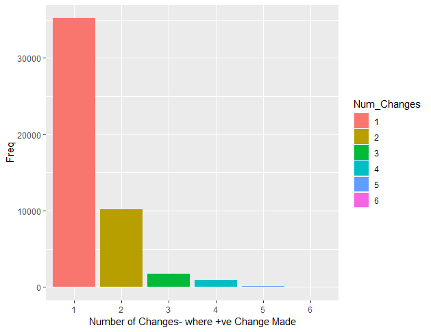
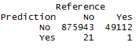

# Playing with Kaggles' Santander Production Recommendation Dataset

This page is where I will document the progress of playing with the aforementioned dataset.  This competition ran back in 2016 and provided Kagglers with approximately customer records, with monthly snapshots going back over 18 months.  There are approximately 1million unique customers over the 18 month period, and the majority appear in each month.
The data and information can be found [here](https://www.kaggle.com/c/santander-product-recommendation)

# Data
The train data is about 2.3GB in size.  You can see how I read it in in the script /DataPrep/dataprep.R.
On a machine with 2 cores & 8GB RAM, this took 15 minutes to load.  To enable you to follow along, I created a couple of monthly snapshots of data, and saved these.  These are in the /data folder.

Essentially what I am doing here is taking a month (March 2016) as my training base, and then adding in what changed in the following month.  This is then my basic training set.  This then consists of 1 record per customer, with their characteristics in March 2016, and whether they changed their product combinations in April 2016.

Whilst I'm here, I identify exactly what has been changed from one month to the next (ie which products have been changed from March to April) to see if there is a majority to focus on, which might help to identify next steps for feature selection.  

The below is a which shows how many customers made a change from March to Aril 2016.

This is therefore a sparse dataset.  There are 900k customers, and just under 50k made a change ie 5%.  0.15% closed their accounts.  
 - This suggests a couple of approaches will need to be considered.
	 - **Rebalancing the data set:** - the dataset is approximately 95:5 in favour of no change, which might allow a model to have 95% accuracy by predicting none change.  This can be overcome by changing the proportion in the training set (not the test data set).  This is known as rebalancing.
	 - **Using a Boosting approach:**  Boosting is a type of Machine Learning algorithm which takes weak classifiers and combines them to make a stronger prediction.  This is also a typical approach with a sparse data set.

Below is a chart showing how the ~50k changes split up into how many new products were picked up.

It is interesting to note that about 73% of the time 1 product is added.  It would be interesting to see if there are different customer segments behind this.

/dataprep/dataprep_test.R is a replication of what has been done to the train dataset for the test data set, so that predictions can be run.  Again all data is provided in the /data folder.

# Free Lunch...
There is no such thing as a free lunch, but sometimes it's worth seeing how much information is already provided in the data set.  Therefore my Free lunch scripts (under /modelling), run a number a Machine Learning algorithms on the data before I do any Feature Engineering.

I used an AWS 2xLarge machine to run these models.  Initially, I attempted to run models on the ~1m customer records but this continually ran out of memory, so I changed tack and created numerous downsized data sets of 100k rather than 1m.

  1. 100k observations: Randomly selected with the same proportions to
        the original data (95% no change, 5% change)
 2. 100k observations: Using the    [ROSE](https://cran.r-project.org/web/packages/ROSE/ROSE.pdf)        package, created an equally balanced (50 50 split) of the data 
			 *- ROSE creates rebalances the dataset, using synthetic data.  More
        details are available in the link above.* 
 3. 100k observations: Using the ROSE package, created an less balanced (75: 25 No Change:    Change split) of the data 
 4. 100k observations: Randomly selected
    overweighting which had a 50 50 weighting

For each of these 4 models, I ran a classification random forest with 200 trees, and nodesize of at least 20 to avoid overfitting. 

The ideal scenario would be to run the model on the whole dataset.  However, this proved too computationally heavy, therefore option 1 is the most representative option, as it maintains the structure of the data.

 *- Results here were very high accuracy, but when looking at the Out of Bag (OOB) results (generated on the train set) and the confusion matrix on the test, everything was predicted to "Not Change."  This was an expected result, and leads to looking at rebalancing the train set.*
 
The ROSE package rebalances the dataset, and creates synthetic data which represents the entire data set.  This is a package I have successfully used previously to enhance results.  The downside to rebalancing the training set is that one is adjusting the prior probabilities going into the model, and this needs to be considered when using the probabilities to find an optimal cutoff.

In the second round, I used ROSE to create a balanced data set (50 50 No Changed vs Change), and run the results.  
 *- Results here were completely opposite to the previous model, and classified almost everything as changed*

Given the complete opposites of the spectrum from the previous 2 results, I attempted a halfway house, where the dataset was a ROSE rebalanced dataset of 75% non changed, and 25% changed.

 *- Sadly results here were almost exactly the same here as they were for the other ROSE attempt, with every customer being predicted to change.*

ROSE apparently doesn't work here and so I attempted a final rebalanced dataset, but defining this manually.

 - The results here were more dispersed, however on closer inspection, it became clear that the model was guessing as in each class the prediction was split 80:20.

These results are not particularly surprising.  Taking data and throwing at a model was unlikely to give a good result.
# Next Steps
Given this is sparse data, I will attempt xgboost as this is very good with sparse data and weak classifiers.  I hope this will also indicate which features to look more closely at.
I will build a shiny app to visualise the data and identify what features to build.  Thus far, I have only used the current months' data to predict if the customer will add a new product.  I will look to add more months to the data set and see what differentiators there are.

***# To be continued...***
